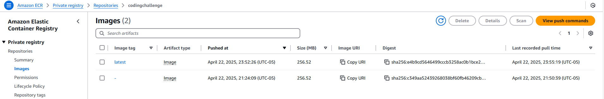
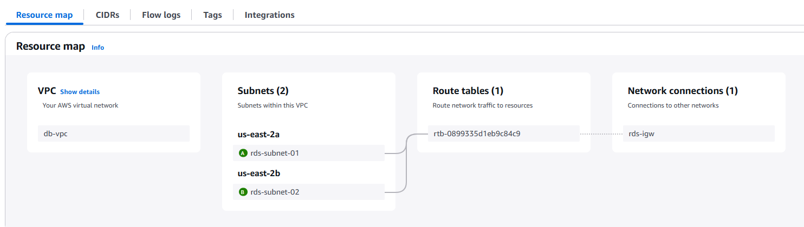
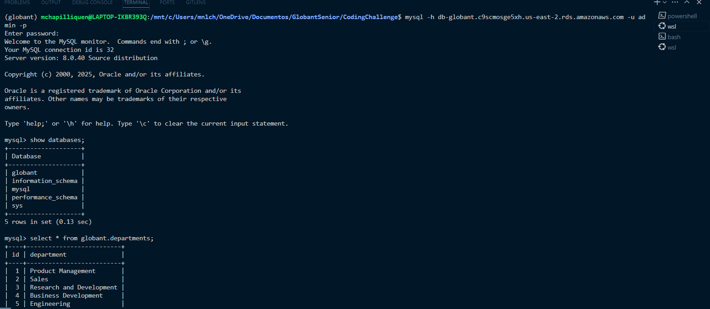
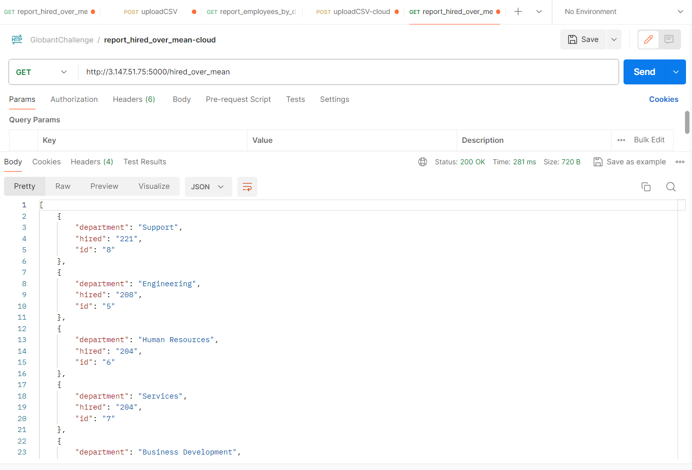

# CodingChallenge
Globant Data Engineer Coding Challenge

# developed from virtual env Python3.9

## 📅 Historial de Avances

### 🗓️ **19.04.2025**
- Se creó y testeó el entorno virtual con Python 3.9
- Implementación inicial de endpoints `/upload/csv`, `/employees_by_department_job`, `/hired_over_mean`
- Se comenzó el testing local de los servicios Flask
- Se estructura correctamente el backend y la lógica de procesamiento CSV

### 🗓️ **20.04.2025**
- Se refactorizó código para usar SQLAlchemy + MySQL
- Se personalizaron las consultas SQL para análisis trimestral y comparativo por promedio

### 🗓️ **21.04.2025**
- Proyecto Dockerizado exitosamente (`Dockerfile`, `.dockerignore`)
- Se configuró correctamente `.env` y variables de entorno
- Se testearon los servicios localmente desde contenedor Docker

### 🗓️ **22.04.2025**
- Se creó repositorio privado en **Amazon ECR**
- Imagen Docker fue subida correctamente con etiqueta `latest`
- Task Definition y servicio ECS en Fargate fueron creados desde la consola AWS
- Se configuró la red pública para tareas Fargate (subredes, IGW, route tables)

### 🗓️ **23.04.2025**
- Se configuró y desplegó **base de datos MySQL en Amazon RDS**
- Se resolvió error de conexión (`host.docker.internal`) cambiando por el endpoint real de RDS
- Se ajustaron las reglas de los Security Groups para permitir tráfico entre ECS y RDS
- Se migró correctamente el código a ECS con base de datos funcional
- Aplicación Flask corriendo en ECS + RDS en entorno cloud

## 📷 Evidencias y Capturas de Pantalla

### 📸 Captura - Servicio ECS en ejecución

  

### 📸 Captura - Imagen Docker subida a ECR

### 📸 Captura - Networks

### 📸 Captura - Base de datos RDS conectada

### 📸 Captura - Prueba de servicios online

